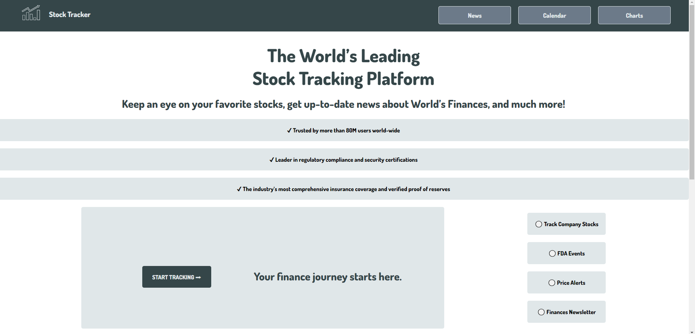
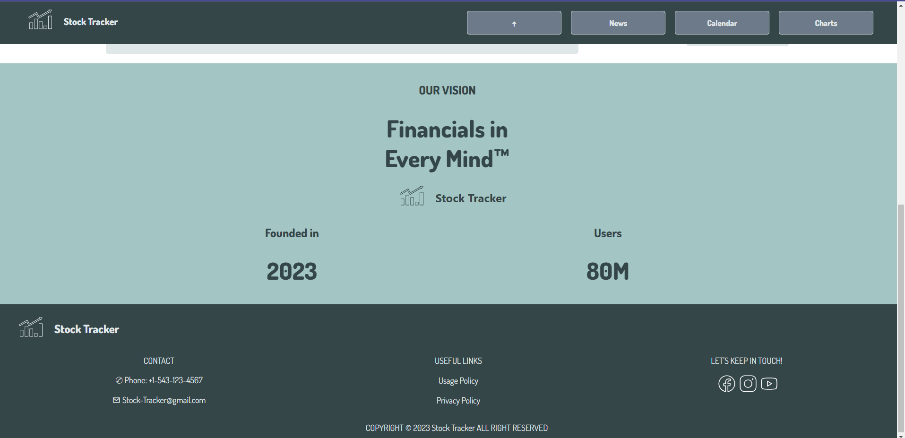
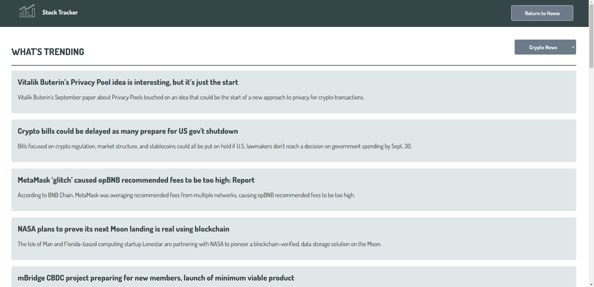
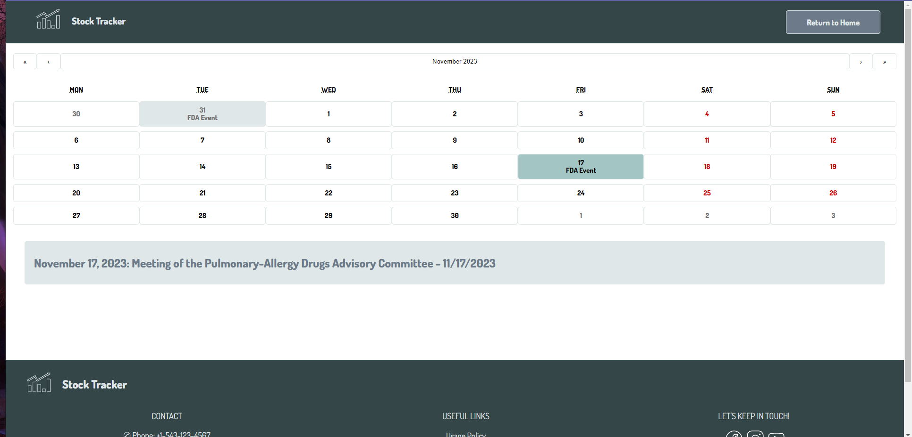
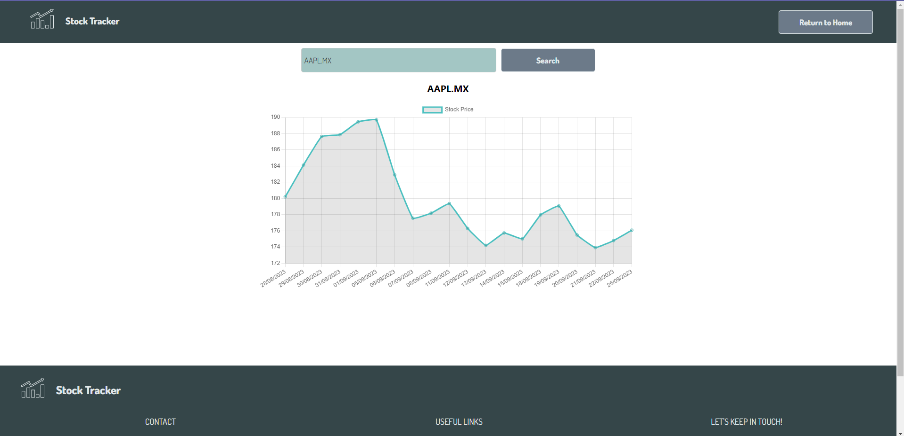

# Stock Tracker - Financial Data Processing Web Application

This web application is built using React.js and utilizes the Finhub API for financial data retrieval and Chart.js for visualizing stock data. It offers various features related to financial data processing.

## Table of Contents

- [Features](#features)
- [Screens](#screens)
- [Usage](#usage)

## Features

1. **Home Page with Login Screen:**
   - Users can access the application that has a log in button.
   
2. **News Page with Financial World News:**
   - Latest financial world news is displayed and can be filtered based on user preferences.
   
3. **Calendar Page with Active Events:**
   - A calendar view displaying active financial events and related information.
   
4. **Charts Page for Stock Data:**
   - Users can search for stocks and view interactive charts based on the provided data.

## Screens

1. **Home/Login Screen:**
   - 
   - 

2. **News Page:**
   - 

3. **Calendar Page:**
   - 

4. **Charts Page:**
   - 

## Usage

To use this application, follow these steps:

1. Clone the repository.
2. Install the necessary dependencies with npm install.
3. Run the application locally.
4. Access the different pages and features as needed.
